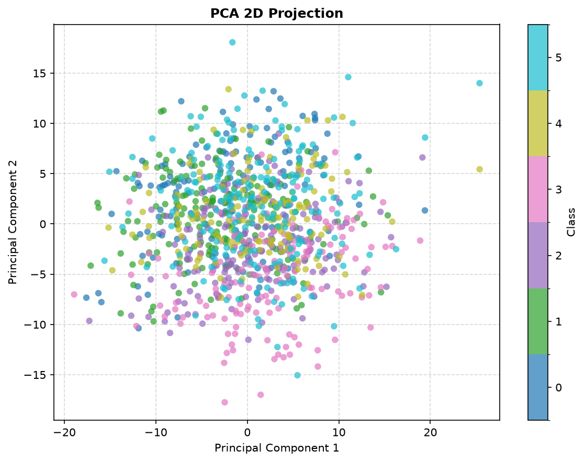
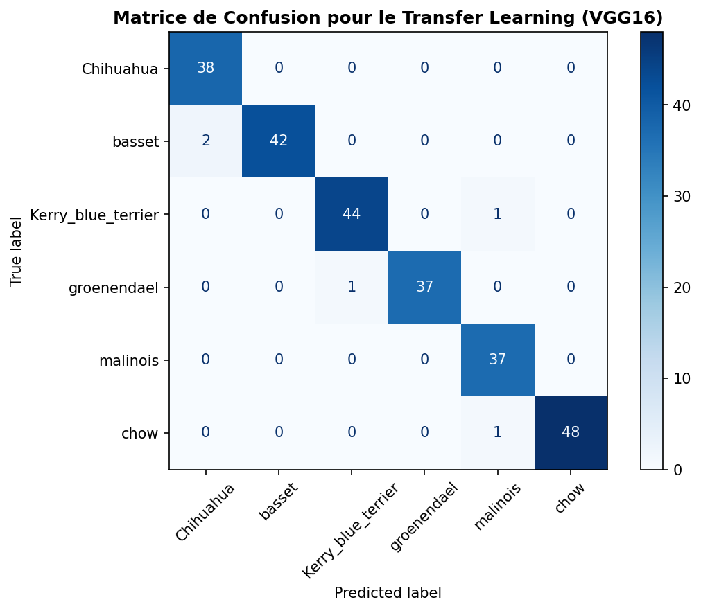
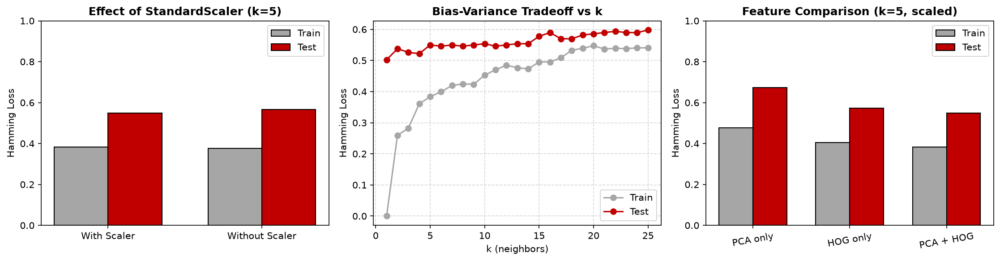

# 🐶 Dog Breed Classification

[](https://github.com/BnRomain/dog-breed-classification/actions/workflows/ci.yml)
[](https://github.com/BnRomain/dog-breed-classification/actions/workflows/github-code-scanning/codeql)
[](https://github.com/BnRomain/dog-breed-classification/releases)
[](LICENSE)


Recognize the breed of a dog from a photo, among six breeds of the **Stanford Dogs** dataset, with two approaches compared on the same data:

- a **classical pipeline** built from scratch with scikit-learn and scikit-image: bounding box cropping, aspect-preserving resizing, **PCA** and **HOG** features, then **kNN** and **SVM** classifiers, tuned by grid search;
- **transfer learning** with a frozen **VGG16** network and a small trained head.

The classical pipeline plateaus around **60 %** of correct answers, whatever the classifier or its tuning. Transfer learning reaches **98 %**. The lesson of the project: the features set the ceiling, not the classifier.

| Context | Authors | Supervisors |
| --- | --- | --- |
| Introduction to Machine Learning, one-week project (MAM3), June 2026, Polytech Nice Sophia (Université Côte d'Azur) | Romain Ben, Zouhair Saitout, Evrard Lecureur | Mahmoud Elsawy and Jean-Luc Bouchot (Inria) |

## 📸 Preview

| PCA projection: the breeds overlap | Transfer learning: 5 errors out of 251 |
| --- | --- |
|  |  |



## 🎯 The Problem

The dataset, `SmallDB/`, is a subset of Stanford Dogs: 1,002 photos of six breeds (Chihuahua, basset, Kerry blue terrier, groenendael, malinois and chow), each with a Pascal VOC XML file giving the bounding box of the dog. The classes are balanced: the Shannon entropy of the class distribution is 1.786, close to the maximum ln 6 = 1.792, so the accuracy is a fair metric.

Telling these breeds apart requires fine details (ears, muzzle, coat texture) that generic descriptors do not capture. The project measures how far a classical pipeline can go, explains why it plateaus, and shows that learned features remove the ceiling.

## 🛠️ How It Works

### Classical pipeline (`src/preprocessing_knn.py` and `src/svm_grid_search.py`)

1. **Cropping**: each photo is cropped to the bounding box of its XML annotation, which removes most of the background.
2. **Resizing without distortion**: the crop is scaled by $\min(h_r, w_r)$ to fit a $64 \times 64$ canvas and centered. The empty borders are filled by one of six padding strategies (white, black, continuous, reflect, random, propagated blur). Uniform padding creates artificial edges that fool the HOG descriptor, so the pipeline uses a **propagated blur** of the border pixels.
3. **PCA**: a global PCA gives the scree plot, the 2D projection and the reconstruction of an image from its first $k$ components. For classification, one PCA is fitted **per class** and each image is projected on the 5 first components of each of them.
4. **HOG**: Sobel gradients, a $4 \times 4$ grid of cells and 8 orientation bins per cell, implemented by hand.
5. **kNN**: the PCA and HOG features are concatenated and standardized (the `StandardScaler` matters: without it the PCA coordinates dominate the distances). The analysis covers the effect of the scaler, the bias-variance trade-off against $k$ and an ablation of the features.
6. **SVM**: the same features are wrapped in scikit-learn transformers inside a `Pipeline` and a `FeatureUnion`, which avoids data leakage. A `GridSearchCV` (3 folds) tunes the number of components, $C$ and $\gamma$ of the RBF kernel, and the one-versus-one and one-versus-rest strategies are compared with linear and RBF kernels.

### Transfer learning (`src/transfer_learning.py`)

The color crops are resized to $224 \times 224$ and fed to **VGG16** pre-trained on ImageNet, with its convolutional layers frozen. A head made of a global average pooling, a dense layer of 256 units with dropout and a softmax over the six breeds is trained for 8 epochs.

## 📊 Results

Accuracy on the test set (25 % of the images, stratified split), as reported in the [report](docs/report-fr.pdf):

| Model | Features | Test accuracy |
| --- | --- | --- |
| kNN ($k = 5$, standardized) | PCA + HOG | 45.0 % |
| SVM one-versus-one, linear kernel | PCA + HOG | 52.6 % |
| SVM one-versus-rest, linear kernel | PCA + HOG | 48.6 % |
| SVM one-versus-one, RBF kernel (tuned) | PCA + HOG | 58.6 % |
| SVM one-versus-rest, RBF kernel (tuned) | PCA + HOG | 59.4 % |
| **Transfer learning, VGG16 frozen + trained head** | learned | **98.0 %** |

The kNN ablation shows that PCA and HOG are complementary (in the CI run, PCA only: 32.7 %, HOG only: 43.0 %, both: 44.2 %). The SVM confuses mostly the Kerry blue terrier and the groenendael, two dark, long-haired breeds with similar silhouettes.

The `pipeline` job of the CI reruns the classical pipeline on every push and publishes the scores in its summary. With the versions pinned in `requirements.txt`, the grid search selects $\gamma = 0.005$ and 10 components per class, and the tuned SVMs reach about 61 % (one-versus-one) and 59 % (one-versus-rest): the exact values move by a point or two with the library versions and the platform, the conclusion does not.

## 🚀 Getting Started

Requires Python 3.12. The dataset is included in the repository.

```bash
git clone https://github.com/BnRomain/dog-breed-classification.git
cd dog-breed-classification
python -m venv .venv
source .venv/bin/activate          # Windows: .venv\Scripts\activate
pip install -r requirements.txt

python src/preprocessing_knn.py    # figures, kNN analysis, cached arrays (about 30 s)
python src/svm_grid_search.py      # SVM pipeline and grid search (about 2 min)
```

The figures are written to `docs/figures/` and the data matrices to `cache/`. Two more scripts regenerate the class balance bar plot and the PCA reconstruction with $256 \times 256$ images used in the report:

```bash
python scripts/make_class_balance.py
python scripts/make_pca_reconstruction.py
```

The transfer learning needs TensorFlow, which downloads the VGG16 weights on first run (about 60 MB). A GPU is recommended: on a CPU, count tens of minutes for the 8 epochs:

```bash
pip install tensorflow
python src/transfer_learning.py    # set ARCHITECTURE = "xception" in the script to try Xception
```

## 🗂️ Repository Structure

```text
dog-breed-classification/
├── src/
│   ├── preprocessing_knn.py      loading, cropping, resizing, PCA, HOG and kNN analysis
│   ├── svm_grid_search.py        scikit-learn pipeline, grid search, OvO versus OvR
│   └── transfer_learning.py      VGG16 or Xception with a trained head (TensorFlow)
├── tests/                        pytest tests of the preprocessing and feature functions
├── scripts/                      figures of the report and generation of the slides
├── docs/
│   ├── figures/                  figures generated by the scripts
│   ├── report-fr.pdf, .tex       report (French, 5 pages)
│   ├── slides-fr.pptx            slides of the 10-minute talk (French)
│   └── talk-script-fr.md         talk script, slide by slide (French)
├── SmallDB/                      dataset: images and Pascal VOC annotations, six breeds
├── .github/                      workflows, issue and pull request templates, Dependabot
├── requirements.txt              dependencies (pinned versions)
├── requirements-dev.txt          test, lint and slides dependencies
├── pyproject.toml                Ruff, pytest and coverage configuration
├── CITATION.cff                  citation metadata
├── CODE_OF_CONDUCT.md            code of conduct
├── CONTRIBUTING.md               contributing guide
├── LICENSE                       MIT License
└── SECURITY.md                   security policy
```

## ✅ Tests and Quality

On every pull request and every push to `main`, GitHub Actions runs:

- **python**: Ruff lint and format check, then `pytest` with a coverage report on the preprocessing, PCA and HOG functions (the CI fails below 60 %);
- **pipeline**: the classical pipeline end to end on `SmallDB`, with the scores in the job summary and the figures as an artifact;
- **docs**: markdownlint, then lychee checks the links, heading anchors and images of the Markdown files;
- **Dependency review**: blocks a pull request that adds a vulnerable dependency;
- **CodeQL**: security analysis of the Python code and the workflows.

The `main` branch is protected: every change goes through a pull request and can only be merged once these checks pass. Secret scanning with push protection blocks any committed credential.

Versions follow [Semantic Versioning](https://semver.org/) and are published as [GitHub releases](https://github.com/BnRomain/dog-breed-classification/releases): see the [contributing guide](CONTRIBUTING.md#versioning-and-releases).

**Dependabot** monitors the Python dependencies and the GitHub Actions. Patch and minor updates are merged automatically once the required checks of `main` have passed. See also the [security policy](SECURITY.md) and the [wiki](https://github.com/BnRomain/dog-breed-classification/wiki).

## 📄 Report, Slides and Talk Script

The deliverables of the project are in French:

- **📑 Report (5 pages)**, with the analysis of every step and the choices made: [read the report](docs/report-fr.pdf) (source: [`docs/report-fr.tex`](docs/report-fr.tex))
- **📊 Slides** of the 10-minute talk: [`docs/slides-fr.pptx`](docs/slides-fr.pptx), generated by [`scripts/build_slides.py`](scripts/build_slides.py)
- **🎤 Talk script**, slide by slide for the three speakers, with the answers prepared for the jury: [read the script](docs/talk-script-fr.md)

## 🙏 Acknowledgments

- The scripts started from the templates of the course repository [pns-mam/ml-intro](https://github.com/pns-mam/ml-intro) (MIT License), written by Mahmoud Elsawy and Jean-Luc Bouchot, who also supervised the project.
- `SmallDB/` is a subset of the [Stanford Dogs dataset](http://vision.stanford.edu/aditya86/ImageNetDogs/): A. Khosla, N. Jayadevaprakash, B. Yao and L. Fei-Fei, *Novel Dataset for Fine-Grained Image Categorization*, CVPR workshop on fine-grained visual categorization, 2011. The images come from ImageNet and are provided for non-commercial research and educational use.

## 🤝 Contributing

Contributions are welcome. Please read the [contributing guide](CONTRIBUTING.md) and the [code of conduct](CODE_OF_CONDUCT.md) before opening an issue or a pull request. Security vulnerabilities must be reported privately, as described in the [security policy](SECURITY.md).

## 📜 License

The code and the documentation are released under the [MIT License](LICENSE). The dataset in `SmallDB/` keeps the terms of Stanford Dogs and ImageNet, see [Acknowledgments](#-acknowledgments).

## 📚 Citation

To cite this project, use the metadata in [`CITATION.cff`](CITATION.cff) or the "Cite this repository" button on GitHub.
